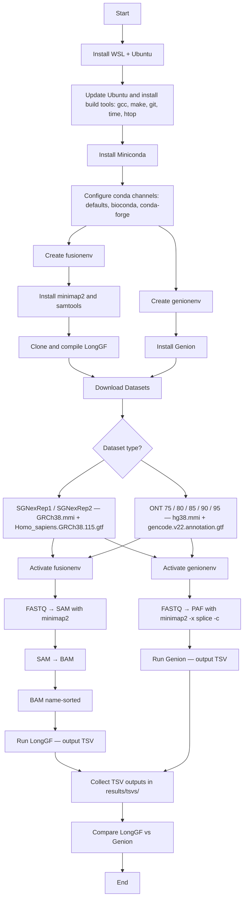

```mermaid
flowchart TD

A[Start] --> B[Install WSL + Ubuntu]

B --> C[Update Ubuntu and install build tools: gcc, make, git, time, htop]

C --> D[Install Miniconda]

D --> E[Configure conda channels: defaults, bioconda, conda-forge]

E --> F[Create fusionenv]

F --> G[Install minimap2 and samtools]

G --> H[Clone and compile LongGF]

E --> I[Create genionenv]

I --> J[Install Genion]

H --> K[Download Datasets]

J --> K

K --> L{Dataset type?}

L --> M[SGNexRep1 / SGNexRep2 — GRCh38.mmi + Homo_sapiens.GRCh38.115.gtf]

L --> N[ONT 75 / 80 / 85 / 90 / 95 — hg38.mmi + gencode.v22.annotation.gtf]

M --> O[Activate fusionenv]

N --> O

O --> P[FASTQ → SAM with minimap2]

P --> Q[SAM → BAM]

Q --> R[BAM name-sorted]

R --> S[Run LongGF — output TSV]

M --> T[Activate genionenv]

N --> T

T --> U[FASTQ → PAF with minimap2 -x splice -c]

U --> V[Run Genion — output TSV]

S --> W[Collect TSV outputs in results/tsvs/]

V --> W

W --> X[Compare LongGF vs Genion]

X --> Y[End]
```
