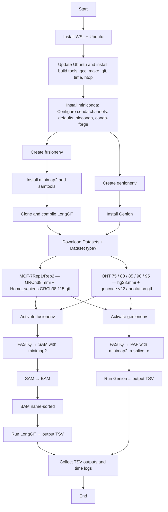

```mermaid
---
config:
  theme: mc
---
flowchart TB
    A["Start"] --> B["Install WSL + Ubuntu"]
    B --> C["Update Ubuntu and install build tools: gcc, make, git, time, htop"]
    C --> E["Install miniconda: Configure conda channels: defaults, bioconda, conda-forge"] --> F["Create fusionenv"] & I["Create genionenv"]
    F --> G["Install minimap2 and samtools"]
    G --> H["Clone and compile LongGF"]
    I --> J["Install Genion"]
    H --> K["Download Datasets + Dataset type?"]
    J --> K
    K --> M["MCF-7Rep1/Rep2 — GRCh38.mmi + Homo_sapiens.GRCh38.115.gtf"] & N["ONT 75 / 80 / 85 / 90 / 95 — hg38.mmi + gencode.v22.annotation.gtf"]
    M --> O["Activate fusionenv"] & T["Activate genionenv"]
    N --> O & T
    O --> P["FASTQ → SAM with minimap2"]
    P --> Q["SAM → BAM"]
    Q --> R["BAM name-sorted"]
    R --> S["Run LongGF → output TSV"]
    T --> U["FASTQ → PAF with minimap2 -x splice -c"]
    U --> V["Run Genion→ output TSV"]
    S --> W["Collect TSV outputs and time logs"]
    V --> W
    W --> X["End"]

```
